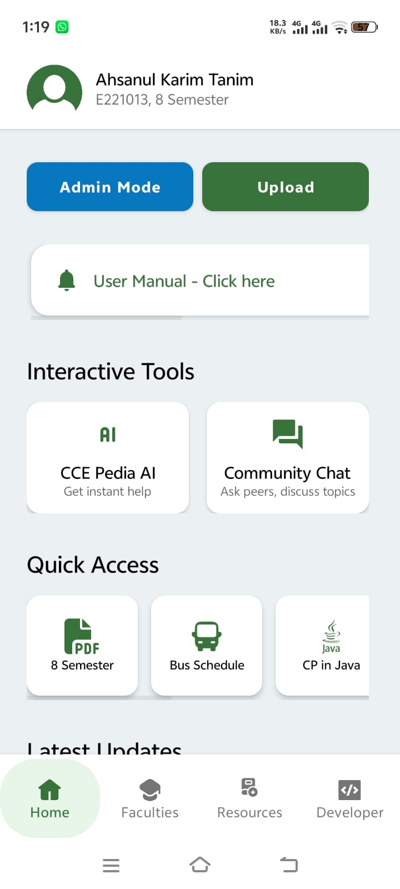
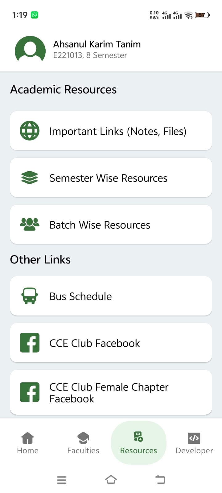
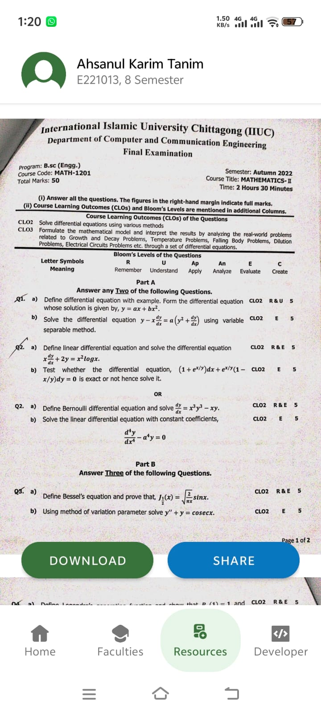
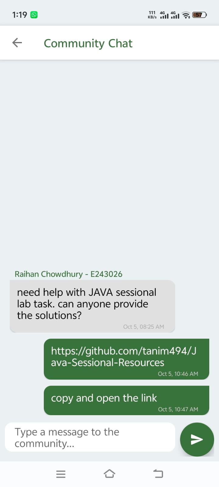

# 📘 IIUC Pedia

**IIUC Pedia** is a comprehensive study companion Android app built for **all students of IIUC**.
It provides organized, department-specific access to lecture notes, lab resources, and question papers, all in one place.

-----

## ✨ Features

  * 🌍 **Multi-Department Support** — All resources are now categorized by department (CCE, CSE, BBA, etc.).
  * 🗂️ **Organized Resources** — Materials are sorted semester-wise and batch-wise.
  * ☁️ **Cloud-Based Access** — Real-time data updates from Firebase Firestore.
  * 🔐 **Secure Login** — Firebase Authentication with email verification.
  * 💬 **Community Chat** — An in-app discussion board for students to ask questions, share updates, and collaborate.
  * ⬇️ **Offline Downloads** — Users can save any file (PDF, images) directly to their device.
  * 📤 **Easy Sharing** — Share web links or files directly from the app.
  * 🖼️ **Modern UI** — Built with Material Design components, including an in-app web viewer and PDF viewer.
  * 📊 **Admin Panel** — A complete in-app management system for admins/moderators to add/edit/delete resources, manage users, and update app config.

-----

## 🧱 Tech Stack

| Component | Technology |
| :--- | :--- |
| Language | Java |
| Backend | Firebase Firestore |
| Authentication | Firebase Auth |
| File Storage | Firebase Storage |
| Image Loading | Glide |
| List Rendering | RecyclerView |
| PDF Viewing | AndroidPdfViewer |
| IDE | Android Studio |

-----

## 👨‍💻 Developer’s Role

Developed entirely by **Ahsanul Karim Tanim**, from UI/UX design to Firebase integration and deployment.
Key contributions include:

  * **Architecture:** Designed and executed the full-scale migration from a single-department app ("CCE Pedia") to a multi-department university-wide solution ("IIUC Pedia").
  * **Backend:** Designed and implemented a hybrid, scalable Firestore structure to support both legacy data and new department hierarchies.
  * **Features:** Built the admin panel, view-tracking system, community chat, AI chatbot, and dynamic resource management.
  * **Deployment:** Manages the Android APK releases and the Vercel-hosted download page.

-----

## 📸 Screenshots

| Home | Resources | PDF View | Community Chat |
|:---:|:---:|:---:|:---:|
|  |  |  |  |

-----

## 🔗 Download APK

👉 [**Download IIUC Pedia APK (Latest)**](https://github.com/tanim494/IIUC-Pedia/releases/download/Release/IIUC.Pedia.v3.5.apk)

-----

## 👨‍💻 Developer

**Ahsanul Karim Tanim**
Android Developer • CCE Student at IIUC

📧 Email: [Tanim494@gmail.com](mailto:Tanim494@gmail.com)
🌐 [GitHub](https://github.com/tanim494)
🔗 [LinkedIn](https://www.linkedin.com/in/tanim494/)

-----

## 📝 License

This project is licensed under the **Apache 2.0 License** — see the [LICENSE](https://www.google.com/search?q=LICENSE) file for details.

-----

## ⭐ About This Project

IIUC Pedia was developed to simplify academic resource sharing for all students at IIUC.
It demonstrates:

  * Full-stack app development (Java + Firebase)
  * Secure authentication and scalable database structuring
  * Clean UI using Material Design
  * Real-time features and dynamic admin controls

> 🏆 This app is showcased as part of my Android development portfolio and reflects my ability to plan, build, scale, and deploy complete solutions independently.
